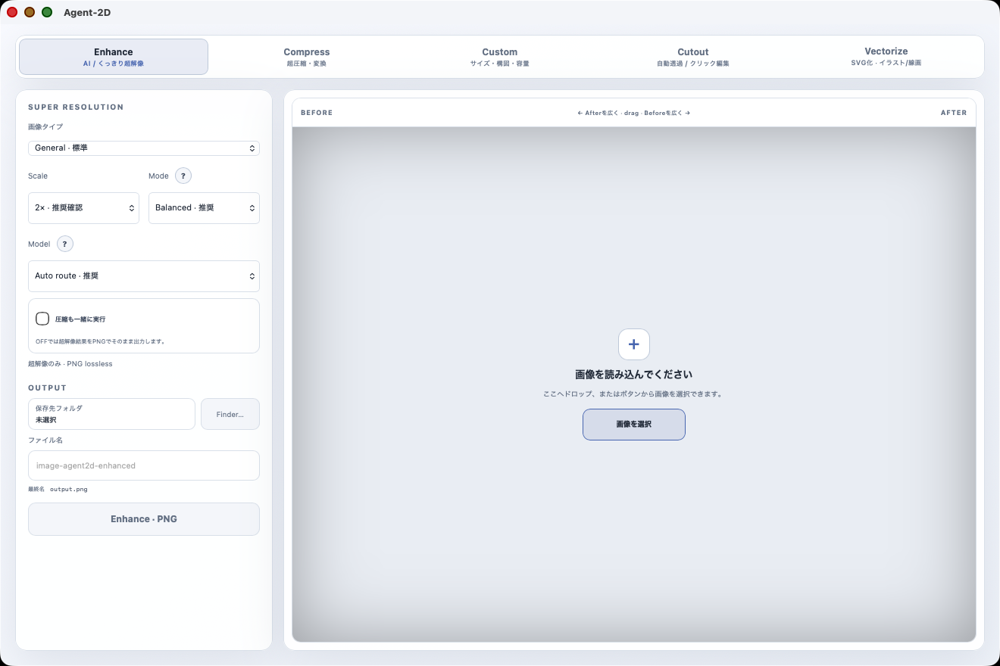

# Agent-2D

<p align="center">
  <a href="https://github.com/uniplanck/Agent-2D/actions/workflows/ci.yml"></a>
  <a href="LICENSE"></a>
  <a href="CONTRIBUTING.md"></a>
</p>

<p align="center">
  <a href="#english"><kbd>English</kbd></a>
  <a href="#japanese"><kbd>日本語</kbd></a>
</p>

<p align="center">
  <a href="README.zh-CN.md">简体中文</a> ·
  <a href="README.zh-TW.md">繁體中文</a> ·
  <a href="README.ko.md">한국어</a> ·
  <a href="README.es.md">Español</a> ·
  <a href="README.fr.md">Français</a> ·
  <a href="README.de.md">Deutsch</a> ·
  <a href="README.pt-BR.md">Português (Brasil)</a>
</p>

---

## Download Agent-2D

**For Apple Silicon Macs.** Normal Desktop users do **not** need Rust, Node.js, Xcode Command Line Tools, Homebrew, `npm`, `cargo`, or Terminal.

1. Download **[Agent-2D-macOS-arm64.zip](https://github.com/uniplanck/Agent-2D/releases/latest/download/Agent-2D-macOS-arm64.zip)** from GitHub Releases.
2. Unzip it.
3. Double-click **Agent-2D.app**. Moving it to `/Applications` is optional.
4. When an AI feature needs Real-ESRGAN, FeyNoBg, SAM 2.1, Big-LaMa, GFPGAN, or NAFNet for the first time, Agent-2D prepares the managed runtime from the GUI and then runs image processing locally.

This project currently uses ad-hoc macOS signing and is not notarized. If macOS blocks the first launch, **Control-click / right-click Agent-2D.app → Open**. If macOS still blocks it, use **System Settings → Privacy & Security → Open Anyway**. No Terminal command is required.

The Release ZIP is the general-user download. **Code → Download ZIP** and `git clone` are source-code paths, not the Desktop download path.

## Build from source

This path is for developers and contributors. It requires Rust 1.87+, Node.js 20+, and Xcode Command Line Tools:

```bash
git clone https://github.com/uniplanck/Agent-2D.git
cd Agent-2D/apps/desktop
npm install
npm run typecheck
npm run release:app
```

General users should use the Release ZIP above instead.

<a id="english"></a>

## English

Agent-2D is a local-first 2D image processing engine for macOS Apple Silicon. It combines super resolution, AI face/noise/blur restoration, compression and format conversion, custom framing, AI background removal, interactive object editing, and raster-to-SVG vectorization in one application.

The same Rust processing core powers the Desktop app, CLI, and MCP server. Image processing does not silently move to a cloud service.


### What Agent-2D can do

| Capability | What it does | Main engine |
| --- | --- | --- |
| **Enhance** | 1× / 2× / 4× AI super resolution or deterministic **Crisp Graphics** scaling for tiny logos/icons, with optional compression after enhancement | Real-ESRGAN + NCNN/Vulkan / local edge-preserving scaler + shared Rust compression pipeline |
| **Restore** | Restore degraded faces, reduce sensor noise, or reduce motion blur while preserving image dimensions | GFPGAN v1.4 / NAFNet SIDD / NAFNet GoPro |
| **Compress** | Compress or convert while preserving dimensions | Rust image pipeline + local codecs |
| **Custom** | Exact output size, framing, zoom, position, ⅛× / ¼× / ½× / 1× / 2× / 4× source-relative presets, Custom scale, and optional target file size | Shared Rust pipeline |
| **Cutout** | Two sidebar modes: automatic background removal or click/box object editing and erase-and-fill | FeyNoBg / SAM 2.1 Base+ + Big-LaMa |
| **Vectorize** | Convert logos, icons, line art, and flat illustrations to real SVG paths | VTracer |

Agent-2D uses PNG, JPEG, WebP, AVIF, and JPEG XL as its five primary formats. TIFF and BMP are also supported as optional lossless formats and can be shown or hidden from **Settings → Output Formats**. PNG/JPEG/WebP/AVIF/TIFF/BMP output paths do not require Homebrew on a clean Mac; AVIF encoding is built into the Rust app. JPEG XL remains optional and is hidden when its local codec backend is unavailable. Target-size lossy WebP can use `cwebp` when present, while standard WebP remains available without it. **Optimize is no longer a separate Desktop tab**: use **Enhance → Compress after enhancement** to run the same super-resolution → compression pipeline. The CLI/MCP optimize contract remains available. Multi-format export, batch input, Before/After comparison, configurable keyboard shortcuts, and multiple UI themes are included. The Desktop UI supports **日本語 / English / 简体中文 / 繁體中文 / 한국어 / Español / Français / Deutsch / Português (Brasil)**, and **System** selects the first supported language from the macOS preferred-language list.

### Interfaces

All three interfaces use the same core processing contract:

- **Desktop**: Tauri 2 + React
- **CLI**: `agent2d`
- **MCP**: TypeScript stdio server

The Desktop and MCP layers do not maintain separate image-processing implementations.

### Repository layout

The public repository is kept deliberately small at the top level:

```text
apps/      Desktop application
crates/    Shared Rust core, compression, SR, pipeline, and CLI
mcp/       MCP stdio server
docs/      Architecture, development notes, research, and screenshots
.github/   Contribution templates and release automation
```

Start with this README for usage, [`CONTRIBUTING.md`](CONTRIBUTING.md) for development workflow, and [`docs/README.md`](docs/README.md) for deeper technical notes.

### Developer requirements

Current development and release validation targets **macOS on Apple Silicon**. These requirements apply only when building from source, not when using the Release ZIP.

For a source build, install:

- Rust **1.87+**
- Node.js **20+**
- Xcode Command Line Tools

Optional advanced codec paths can discover local tools such as `cwebp`, `ffmpeg`, or `cjxl`, but the Release Desktop does not require the user to install them for its native PNG/JPEG/WebP/AVIF/TIFF/BMP output paths. Large AI runtimes are managed outside the app bundle and are prepared by Agent-2D itself.

### Developer Desktop build

```bash
git clone https://github.com/uniplanck/Agent-2D.git
cd Agent-2D/apps/desktop
npm install
npm run typecheck
npm run release:app
```

The generated Apple Silicon app bundle is created under:

```text
target/aarch64-apple-darwin/release/bundle/macos/Agent-2D.app
```

For a DMG build:

```bash
npm run release:mac
```

The default local build uses ad-hoc signing. A public macOS binary that opens without Gatekeeper warnings requires a valid Developer ID Application certificate and Apple notarization credentials.

### Updates

The Desktop Settings screen includes an **Updates** section. Manual checks and optional automatic updates use signed artifacts published through **GitHub Releases**. Source commits on `main` are not installed directly: a maintainer publishes a signed release, the app verifies that release metadata, and only then installs the update.

Release packaging is defined in [`.github/workflows/release.yml`](.github/workflows/release.yml). The repository intentionally keeps the updater private signing key out of source control.

### Optional AI runtimes

Agent-2D keeps large model/runtime assets outside the app bundle. In the Desktop app, the first use of a feature automatically offers/prepares its missing managed runtime, and **Settings → AI Runtime** also provides status and Install/Repair controls. No Homebrew or Terminal setup is required for normal Desktop use.

#### Super resolution

```bash
cargo run -p agent2d-cli -- runtime-status
cargo run -p agent2d-cli -- runtime-install
cargo run -p agent2d-cli -- capabilities
```

Managed runtime location:

```text
~/Library/Application Support/Agent-2D/runtime/realesrgan-ncnn-vulkan-20220424
```

The Real-ESRGAN archive is pinned by SHA-256 in the implementation and downloaded from the upstream project.

For tiny logos, icons, UI marks, or flat graphics where photo-oriented AI can soften edges or invent texture, choose **Crisp Graphics** in the Desktop Content selector or use `--preset graphics` from CLI/MCP. This route deliberately bypasses Real-ESRGAN and uses a deterministic edge-preserving resize plus light sharpening. It cannot reconstruct detail that is absent from the source, but it avoids turning a tiny graphic into a larger blur.

```bash
cargo run -p agent2d-cli -- enhance tiny-logo.png crisp.png --scale 4 --preset graphics --format png
```

#### Background removal

```bash
cargo run -p agent2d-cli -- bg-runtime-status
cargo run -p agent2d-cli -- bg-runtime-install
cargo run -p agent2d-cli -- remove-bg input.jpg output.png --format png
```

Agent-2D uses `feyninc/FeyNobg` through the upstream `nobg` library. Normal inference is configured for local/offline use after installation and prefers Apple MPS with a CPU fallback.

#### Object Edit

```bash
cargo run -p agent2d-cli -- object-runtime-status
cargo run -p agent2d-cli -- object-runtime-install
cargo run -p agent2d-cli -- object-mask input.png mask.png --include 320,240 --exclude 80,80 --expand 2 --feather 1
cargo run -p agent2d-cli -- object-edit input.png output.png --action make-selected-transparent --include 320,240 --format png
cargo run -p agent2d-cli -- object-edit input.png filled.png --action remove-and-fill --include 320,240 --format png
cargo run -p agent2d-cli -- object-bridge
```

`object-bridge` keeps the Rust process and SAM worker alive so repeated selections can reuse the active image embedding. The MCP server uses this persistent bridge automatically while the server process is alive.

### Custom framing and multi-format output

Custom mode supports exact dimensions or a source-relative multiplier. The Desktop exposes quick source-relative presets for **⅛×, ¼×, ½×, 1×, 2×, and 4×**, plus an editable Custom multiplier.

```bash
# Exact 1080 × 1350 frame with two output formats
cargo run -p agent2d-cli -- custom input.png output.png \
  --width 1080 --height 1350 \
  --zoom 1.2 --x -0.1 --y 0.15 \
  --formats png,jpeg

# Source-relative 2× with a 1 MiB output cap
cargo run -p agent2d-cli -- custom input.png output.png \
  --source-scale 2 \
  --formats jpeg,webp \
  --max-bytes 1048576
```

When multiple formats are selected, Agent-2D writes tagged sibling outputs such as `output-png.png` and `output-jpg.jpg`.

### Vectorize to SVG

Vectorization is separate from super resolution. It targets shape-driven images rather than photography.

```bash
cargo run -p agent2d-cli -- vectorize input.png output.svg \
  --preset logo \
  --detail balanced \
  --max-colors 8
```

Generated SVG output is validated to contain real `<path>` geometry rather than an embedded raster `<image>`.

### MCP server

```bash
cd mcp/server
npm install
npm run typecheck
npm run build
npm run acceptance
```

Current MCP tools:

```text
agent2d_inspect
agent2d_compress
agent2d_upscale
agent2d_enhance
agent2d_restore
agent2d_custom
agent2d_remove_background
agent2d_object_select
agent2d_object_edit
agent2d_vectorize
agent2d_optimize
agent2d_capabilities
```

### Local-first boundary

Agent-2D does not bundle the large Real-ESRGAN, FeyNoBg, SAM 2.1, Big-LaMa, GFPGAN, or NAFNet model assets in the Git repository or general-user ZIP. The Desktop prepares a missing managed runtime on first use (or through Settings → AI Runtime), then normal processing stays on the local machine.

### Validation

The current project validation includes:

- PNG/WebP/JXL exact-output fixtures and AVIF/JPEG preserve-oriented fixtures
- PNG/JPEG/WebP/AVIF/JXL input inspection and conversion paths
- Real-ESRGAN logical model routing
- real process cancellation and partial-output cleanup
- Desktop typecheck/build and native arm64 app launch
- path-based SVG verification
- FeyNoBg transparent-output verification when its runtime is installed
- SAM 2.1 selection, transparent Object Edit, and Big-LaMa erase-and-fill E2E when the runtime is installed
- GFPGAN face restoration and NAFNet denoise/deblur runtime checks when the restoration runtime is installed
- MCP stdio acceptance tests

### Contributing

Contributions are welcome. Bug reports, feature requests, documentation improvements, and focused pull requests are appreciated. For substantial features, architecture changes, new runtime dependencies, or breaking behavior, please open an Issue first so the direction can be discussed before implementation.

See [`CONTRIBUTING.md`](CONTRIBUTING.md) for setup, validation, branch/PR guidance, and label conventions. Issues labeled [`good first issue`](https://github.com/uniplanck/Agent-2D/labels/good%20first%20issue) are intended as bounded entry points for new contributors; [`help wanted`](https://github.com/uniplanck/Agent-2D/labels/help%20wanted) marks work where outside help is especially useful.

### License

Agent-2D's own source code is released under the **MIT License**. See [`LICENSE`](LICENSE).

Third-party libraries, local codec executables, runtime binaries, and AI model weights retain their own upstream licenses and terms. See [`THIRD_PARTY_NOTICES.md`](THIRD_PARTY_NOTICES.md).

---

<a id="japanese"></a>

## 日本語

画像処理の機能を増やしていくと、超解像はこのアプリ、圧縮は別ツール、背景透過はWebサービス、物体削除はさらに別のAI、と処理が分散しがちです。Agent-2Dは、その分散をローカルの一つの処理基盤へ戻すためのmacOS向け2D画像エンジンです。

超解像、顔復元・ノイズ除去・ブレ補正、圧縮・形式変換、サイズと構図の調整、AI背景透過、クリックによる物体編集、SVGベクター化までを一つのアプリにまとめています。Desktop、CLI、MCPは見た目こそ違いますが、内部では同じRustコアを共有します。Desktopだけ別処理、MCPだけ別品質、という分岐を作らない構成です。



### Agent-2Dをダウンロード

Apple Silicon Macでは、GitHub Releasesの **[Agent-2D-macOS-arm64.zip](https://github.com/uniplanck/Agent-2D/releases/latest/download/Agent-2D-macOS-arm64.zip)** をダウンロードし、解凍して **Agent-2D.app** をダブルクリックするだけです。`/Applications`への移動は任意です。Rust / Node.js / Xcode / Homebrew / Terminalは必要ありません。

現在はnotarizationを行っていないため、初回起動をmacOSに止められた場合は **Agent-2D.appをControlクリック（右クリック）→「開く」**、それでも止まる場合は **システム設定 → プライバシーとセキュリティ →「このまま開く」** を使います。Terminal操作は不要です。

AI機能を初めて使うと、必要なReal-ESRGAN / FeyNoBg / SAM 2.1 / Big-LaMa / GFPGAN / NAFNetをAgent-2D自身が準備します。設定の **AI Runtime** から状態確認・Install / Repairもできます。導入後の画像処理はローカルです。

### できること

| 機能 | 内容 | 主なエンジン |
| --- | --- | --- |
| **Enhance** | 1× / 2× / 4×のAI超解像、または極小ロゴ/アイコン向けの**Crisp Graphics**拡大。必要なら超解像後の圧縮も同時実行 | Real-ESRGAN + NCNN/Vulkan / ローカル輪郭保持scaler + 共通Rust圧縮pipeline |
| **Restore** | 劣化した顔の復元、写真ノイズ除去、モーションブラー/軽い手ブレ補正。画像サイズは維持 | GFPGAN v1.4 / NAFNet SIDD / NAFNet GoPro |
| **Compress** | 解像度を維持した圧縮・形式変換 | Rust画像処理 + ローカルcodec |
| **Custom** | 指定サイズ、構図、Zoom、位置、⅛× / ¼× / ½× / 1× / 2× / 4×の倍率Preset、Custom倍率、最大ファイル容量 | 共通Rust pipeline |
| **Cutout** | サイドバーの2モードから、自動背景透過またはクリック/Box選択・透明化・自然削除を選ぶ | FeyNoBg / SAM 2.1 Base+ + Big-LaMa |
| **Vectorize** | ロゴ・アイコン・線画・フラットイラストをSVG pathへ変換 | VTracer |

主要形式はPNG、JPEG、WebP、AVIF、JPEG XLの5種です。加えてTIFFとBMPをlossless形式として利用でき、**設定 → 出力形式**から表示/非表示を切り替えられます。Desktopでは必要なローカルcodec backendが存在しない形式を自動で非表示にします。**OptimizeはDesktopの独立タブから外し、Enhance内の「圧縮も一緒に実行」に統合**しました。CLI / MCPのoptimize contractは互換性のため残しています。処理内容に応じて複数形式の同時書き出しや複数画像の一括処理もでき、Before / After比較、Theme切替、編集可能なKeyboard Shortcutを利用できます。Desktop UIは **日本語 / English / 简体中文 / 繁體中文 / 한국어 / Español / Français / Deutsch / Português (Brasil)** に対応し、**System**ではmacOSの優先言語リストから最初の対応言語を自動選択します。

### なぜローカルで動かすのか

画像を扱うたびに外部サービスへアップロードする構成は便利ですが、処理の再現性、待ち時間、ネットワーク依存、画像の扱いを一つずつ外部へ預けることになります。Agent-2Dでは、大きなAIモデルも含め、必要なruntimeを初回利用時にアプリ自身が準備し、そのあとはローカル処理を基本にしています。

ただし、最初のruntime導入時には上流の配布元からモデルや依存パッケージを取得します。リポジトリ自体に1GB級のモデルを埋め込んでいるわけではありません。この境界は、アプリを軽く保つためだけでなく、各モデルの配布条件をAgent-2D本体のMIT Licenseと混同しないためにも重要です。

### 構成

処理コアは共通です。

- **Desktop**: Tauri 2 + React
- **CLI**: `agent2d`
- **MCP**: TypeScript stdio server

AI AgentからMCPを使う場合も、Desktopとは別の簡易版処理へ落としません。同じ処理契約を別の入口から呼び出します。

リポジトリの入口は `apps/`（Desktop）、`crates/`（共通Rustコア/CLI）、`mcp/`（MCP Server）、`docs/`（設計・開発資料・research）、`.github/`（Issue/PR/Release運用）に整理しています。開発参加時は [`CONTRIBUTING.md`](CONTRIBUTING.md)、技術資料は [`docs/README.md`](docs/README.md) から辿れます。

### 動作環境

現在の開発・release検証は **Apple Silicon搭載macOS** を基準にしています。

Sourceからbuildする開発者だけ、少なくとも次を用意してください。Release ZIPを使う一般ユーザーには不要です。

- Rust **1.87以上**
- Node.js **20以上**
- Xcode Command Line Tools

PNG / JPEG / WebP / AVIF / TIFF / BMPの主要出力は、Release版でHomebrewなどの手動導入を要求しません。AVIF encodeもRust内蔵です。JPEG XLなど一部のoptional経路は対応codecがない環境では安全に非表示になります。Real-ESRGAN、FeyNoBg、SAM 2.1、Big-LaMa、GFPGAN、NAFNetはアプリが必要時に管理runtimeとして準備します。

### ソースからDesktopをbuildする

```bash
git clone https://github.com/uniplanck/Agent-2D.git
cd Agent-2D/apps/desktop
npm install
npm run typecheck
npm run release:app
```

生成されるApple Silicon向けapp bundle:

```text
target/aarch64-apple-darwin/release/bundle/macos/Agent-2D.app
```

DMGを作る場合:

```bash
npm run release:mac
```

通常のローカルbuildはad-hoc署名です。第三者へGatekeeper警告なしで配布するには、Developer ID Application証明書とApple notarizationが別途必要です。

### アップデート

Desktopの設定には **Updates** セクションがあります。手動確認と自動更新はいずれも、GitHubの `main` を直接取得するのではなく、**GitHub Releasesに公開された署名済みartifact** を利用します。これにより、単なるsource更新と実行可能アプリの更新を混同しません。

### 超解像runtime

```bash
cargo run -p agent2d-cli -- runtime-status
cargo run -p agent2d-cli -- runtime-install
cargo run -p agent2d-cli -- capabilities
```

保存先:

```text
~/Library/Application Support/Agent-2D/runtime/realesrgan-ncnn-vulkan-20220424
```

Real-ESRGANのruntimeは上流releaseから取得し、実装側でSHA-256を固定しています。

極小ロゴ、アイコン、UI記号、ベタ塗りグラフィックでは、写真向けAI超解像が境界を丸めたり、元にない質感を足したりすることがあります。**Crisp Graphics**はその用途を分離した経路です。Real-ESRGANを通さず、輪郭を保つリサイズと軽いsharp処理だけで拡大します。存在しない細部を復元する機能ではありませんが、「小さなモヤをAIでもっと大きなモヤにする」挙動を避けたいときに向いています。

```bash
cargo run -p agent2d-cli -- enhance tiny-logo.png crisp.png --scale 4 --preset graphics --format png
```

### 背景透過runtime

```bash
cargo run -p agent2d-cli -- bg-runtime-status
cargo run -p agent2d-cli -- bg-runtime-install
cargo run -p agent2d-cli -- remove-bg input.jpg output.png --format png
```

背景透過には`feyninc/FeyNobg`を使用します。導入後の通常推論はローカル/オフライン前提で、Apple MPSを優先し、利用できない場合はCPUへfallbackします。

### Object Edit

Object Editは「画像全体を編集する」のではなく、まずSAM 2.1で対象を特定し、そのmaskへ処理を適用します。対象へクリック、除外したい場所へnegative point、広い対象にはBoxを与えられます。maskは拡張/縮小とFeatherで調整できます。

```bash
cargo run -p agent2d-cli -- object-runtime-status
cargo run -p agent2d-cli -- object-runtime-install
cargo run -p agent2d-cli -- object-mask input.png mask.png --include 320,240 --exclude 80,80 --expand 2 --feather 1
cargo run -p agent2d-cli -- object-edit input.png output.png --action make-selected-transparent --include 320,240 --format png
cargo run -p agent2d-cli -- object-edit input.png filled.png --action remove-and-fill --include 320,240 --format png
cargo run -p agent2d-cli -- object-bridge
```

`object-bridge`はSAMを毎回cold startさせないための常駐経路です。同じprocess内で画像embeddingを再利用でき、MCP Serverも起動中はこのbridgeを利用します。

### Customと複数形式書き出し

Customでは、固定のpxサイズだけでなく、元画像基準の倍率も使えます。Desktopには**⅛×、¼×、½×、1×、2×、4×**の即時Presetと、任意倍率を入力するCustom欄があります。

```bash
# 1080 × 1350へ構図を合わせ、PNGとJPEGを同時出力
cargo run -p agent2d-cli -- custom input.png output.png \
  --width 1080 --height 1350 \
  --zoom 1.2 --x -0.1 --y 0.15 \
  --formats png,jpeg

# 元画像の2×、各出力を最大1 MiBへ
cargo run -p agent2d-cli -- custom input.png output.png \
  --source-scale 2 \
  --formats jpeg,webp \
  --max-bytes 1048576
```

複数形式を選んだ場合は、`output-png.png`、`output-jpg.jpg`のように形式名を付けた兄弟ファイルとして保存します。

### SVGベクター化

Vectorizeは超解像とは別物です。写真を「無限解像度」にする機能ではなく、形状が主役の画像をSVG pathとして再構成する処理です。

```bash
cargo run -p agent2d-cli -- vectorize input.png output.svg \
  --preset logo \
  --detail balanced \
  --max-colors 8
```

出力SVGには埋め込みraster画像ではなく、実際の`<path>` geometryが存在することを検証します。

### MCP Server

```bash
cd mcp/server
npm install
npm run typecheck
npm run build
npm run acceptance
```

利用できる主なtool:

```text
agent2d_inspect
agent2d_compress
agent2d_upscale
agent2d_enhance
agent2d_custom
agent2d_remove_background
agent2d_object_select
agent2d_object_edit
agent2d_vectorize
agent2d_optimize
agent2d_capabilities
```

### 検証範囲

現行projectでは、PNG/WebP/JXLのexact出力、AVIF/JPEGのpreserve系出力、各形式のinspection/変換、Real-ESRGAN routing、process cancelと途中ファイル削除、native arm64 Desktop build、SVG path検証、FeyNoBg背景透過、SAM 2.1 + Big-LaMa Object Edit、MCP stdio acceptanceまでを検証対象にしています。

AI runtimeが必要なE2Eは、そのruntimeが導入済みの環境で実行します。テストがあることと、すべての外部modelをリポジトリへ同梱していることは別です。

### Contribution

Bug report、Feature request、ドキュメント改善、焦点を絞ったPull Requestを歓迎します。大きな機能追加、architecture変更、新しいruntime依存、breaking changeは、実装前にIssueで方針を相談してください。

開発環境、テスト、branch/PRルール、label運用は [`CONTRIBUTING.md`](CONTRIBUTING.md) にまとめています。`good first issue` は初参加でも内部構造へ深く踏み込まず対応しやすい粒度、`help wanted` は外部実装を特に歓迎する課題として運用します。

### License

Agent-2D本体のsource codeは **MIT License** です。 [`LICENSE`](LICENSE) を参照してください。

一方、利用しているlibrary、codec、runtime binary、AI model weightには、それぞれ上流のlicenseや利用条件があります。Agent-2DのMIT Licenseがそれらを上書きすることはありません。現在の境界は [`THIRD_PARTY_NOTICES.md`](THIRD_PARTY_NOTICES.md) に整理しています。
