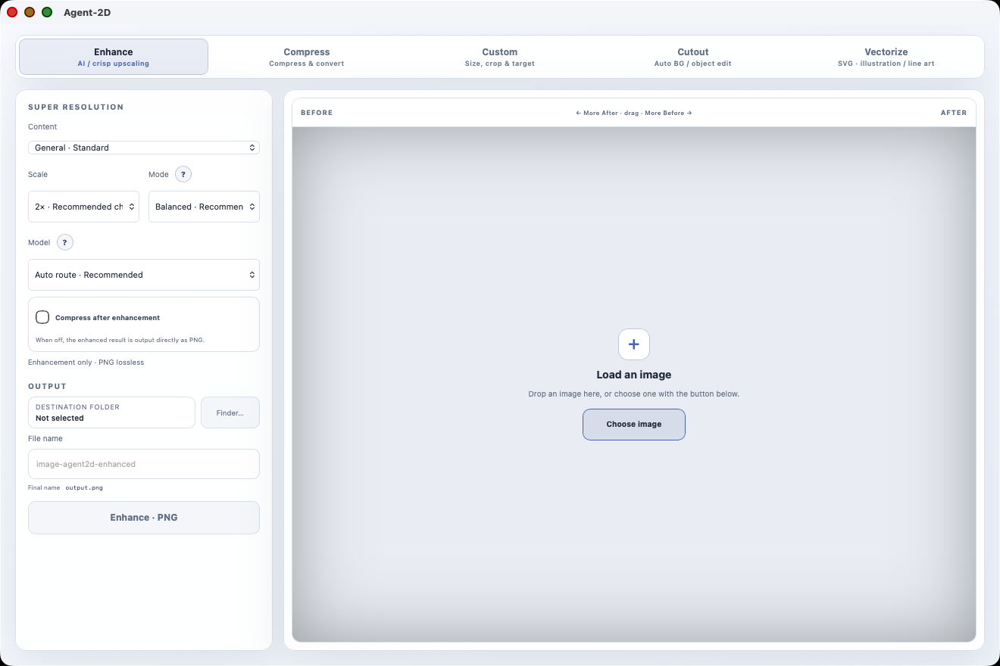

# Agent-2D

<p align="center">
  <a href="README.md#english">English</a> ·
  <a href="README.md#japanese">日本語</a> ·
  <strong>简体中文</strong> ·
  <a href="README.zh-TW.md">繁體中文</a> ·
  <a href="README.ko.md">한국어</a> ·
  <a href="README.es.md">Español</a> ·
  <a href="README.fr.md">Français</a> ·
  <a href="README.de.md">Deutsch</a> ·
  <a href="README.pt-BR.md">Português (Brasil)</a>
</p>

Agent-2D 是一个面向 Apple Silicon macOS 的本地优先 2D 图像处理引擎。它把超分辨率、压缩与格式转换、自定义尺寸和构图、AI 抠图、交互式物体编辑，以及位图转 SVG 集成在同一个应用中。

Desktop、CLI 与 MCP 共用同一套 Rust 处理核心，因此不同入口不会各自维护一套独立的图像处理实现。



> Desktop UI 支持 **日本語 / English / 简体中文 / 繁體中文 / 한국어 / Español / Français / Deutsch / Português (Brasil)**。选择 **System** 时，会从 macOS 的偏好语言列表中使用第一个受支持的语言。

## 下载 Agent-2D

面向一般 Apple Silicon Mac 用户，请直接下载 **[Agent-2D-macOS-arm64.zip](https://github.com/uniplanck/Agent-2D/releases/latest/download/Agent-2D-macOS-arm64.zip)**：下载 → 解压 → 双击 **Agent-2D.app**。是否移动到 `/Applications` 均可。正常 Desktop 使用不需要 Rust、Node.js、Xcode Command Line Tools、Homebrew、npm、cargo 或 Terminal。

目前应用未进行 Apple notarization。如果 macOS 阻止首次启动，请 **Control/右键点击 Agent-2D.app → 打开**；仍被阻止时前往 **系统设置 → 隐私与安全性 → 仍要打开**。不需要 Terminal 命令。

首次使用 Enhance / Cutout / Object Edit 等 AI 功能时，Agent-2D 会自行准备所需的 Real-ESRGAN、FeyNoBg、SAM 2.1 与 Big-LaMa；也可在 **Settings → AI Runtime** 中查看状态或执行 Install / Repair。安装完成后图像处理在本机运行。

## 主要功能

| 功能 | 说明 | 主要引擎 |
| --- | --- | --- |
| **Enhance** | 1× / 2× / 4× AI 超分辨率，或面向小型 Logo/图标的 Crisp Graphics 缩放；可在增强后继续压缩 | Real-ESRGAN + NCNN/Vulkan / 本地边缘保持缩放 + 共用 Rust pipeline |
| **Compress** | 保持尺寸的压缩与格式转换 | Rust pipeline + 本地 codec |
| **Custom** | 指定输出尺寸、构图、缩放、位置、⅛× / ¼× / ½× / 1× / 2× / 4× 预设与目标文件大小 | 共用 Rust pipeline |
| **Cutout** | 自动背景移除，或点击/排除点击/框选后的透明化与自然移除 | FeyNoBg / SAM 2.1 Base+ + Big-LaMa |
| **Vectorize** | 将 Logo、图标、线稿和扁平插画转换为真实 SVG path | VTracer |

应用还支持 PNG、JPEG、WebP、AVIF、JPEG XL 的主要输入输出路径，TIFF/BMP 可作为可选无损格式使用。Desktop 会隐藏当前机器缺少 codec backend 的格式。原来的独立 Optimize 标签页已经合并到 **Enhance → 增强后压缩**；CLI/MCP 的 `optimize` contract 仍保留兼容性。多格式同时导出、批量输入、Before / After 对比、多种主题与可编辑快捷键均可使用。

仓库顶层保持简洁：`apps/` 放 Desktop，`crates/` 放共用 Rust core/CLI，`mcp/` 放 MCP server，`docs/` 放架构、开发资料与 research，`.github/` 放 Issue/PR 模板和 Release automation。参与开发请先阅读 [`CONTRIBUTING.md`](CONTRIBUTING.md)。

## 运行环境

当前开发和 release 验证目标为 **Apple Silicon macOS**。

仅从源码构建的 Developer / Contributor 需要：

- Rust **1.87+**
- Node.js **20+**
- Xcode Command Line Tools

Release Desktop 的 PNG / JPEG / WebP / AVIF / TIFF / BMP 主要输出无需 Homebrew 手动安装 codec；AVIF 编码已内置于 Rust 应用。JPEG XL 等可选路径在缺少 codec 时会安全隐藏。大型 AI runtime 不包含在 app 中，由 Agent-2D 在首次使用时自动准备，也可从 Settings → AI Runtime 执行 Install / Repair。

## 从源码构建

以下步骤仅面向 Developer / Contributor。一般用户请使用上方 Release ZIP。

### 构建 Desktop

```bash
git clone https://github.com/uniplanck/Agent-2D.git
cd Agent-2D/apps/desktop
npm install
npm run typecheck
npm run release:app
```

生成的应用位于：

```text
target/aarch64-apple-darwin/release/bundle/macos/Agent-2D.app
```

生成 DMG：

```bash
npm run release:mac
```

默认本地构建使用 ad-hoc 签名。若要向第三方分发并避免 Gatekeeper 警告，需要 Developer ID Application 证书与 Apple notarization。

## 更新

Desktop Settings 中提供 **Updates** 区域，可手动检查，也可启用自动更新。更新不会直接执行 GitHub `main` 中的源码，而是只安装 **GitHub Releases 中发布并通过签名验证的 artifact**。Release workflow 位于 [`.github/workflows/release.yml`](.github/workflows/release.yml)。

## AI runtime

### 超分辨率

```bash
cargo run -p agent2d-cli -- runtime-status
cargo run -p agent2d-cli -- runtime-install
cargo run -p agent2d-cli -- capabilities
```

### 背景移除

```bash
cargo run -p agent2d-cli -- bg-runtime-status
cargo run -p agent2d-cli -- bg-runtime-install
cargo run -p agent2d-cli -- remove-bg input.jpg output.png --format png
```

### Object Edit

```bash
cargo run -p agent2d-cli -- object-runtime-status
cargo run -p agent2d-cli -- object-runtime-install
cargo run -p agent2d-cli -- object-mask input.png mask.png --include 320,240 --exclude 80,80 --expand 2 --feather 1
cargo run -p agent2d-cli -- object-edit input.png output.png --action make-selected-transparent --include 320,240 --format png
cargo run -p agent2d-cli -- object-edit input.png filled.png --action remove-and-fill --include 320,240 --format png
cargo run -p agent2d-cli -- object-bridge
```

`object-bridge` 会保持 Rust 进程与 SAM worker 常驻，让重复选择复用当前图像 embedding。MCP Server 运行期间会自动使用该 bridge。

## Custom 示例

```bash
cargo run -p agent2d-cli -- custom input.png output.png \
  --width 1080 --height 1350 \
  --zoom 1.2 --x -0.1 --y 0.15 \
  --formats png,jpeg
```

## SVG 矢量化

```bash
cargo run -p agent2d-cli -- vectorize input.png output.svg \
  --preset logo \
  --detail balanced \
  --max-colors 8
```

输出会验证是否包含真实 SVG `<path>`，而不是把原始位图作为 `<image>` 嵌入。

## MCP Server

```bash
cd mcp/server
npm install
npm run typecheck
npm run build
npm run acceptance
```

主要工具：

```text
agent2d_inspect
agent2d_compress
agent2d_upscale
agent2d_enhance
agent2d_custom
agent2d_remove_background
agent2d_object_select
agent2d_object_edit
agent2d_vectorize
agent2d_optimize
agent2d_capabilities
```

## 本地优先边界

Real-ESRGAN、FeyNoBg、SAM 2.1 与 Big-LaMa 的大型模型文件不会提交到仓库。只有在用户明确执行 runtime 安装后才会从上游来源下载。完成安装后，正常图像处理以本机执行为基本原则。

## 参与贡献

Contributions are welcome. 欢迎 Bug report、Feature request、文档改进，以及范围清晰、便于审查的 Pull Request。较大的功能、架构调整、新 runtime 依赖或 breaking change，请先通过 Issue 讨论方向。

开发环境、测试命令、branch/PR 规则及 label 运用见 [`CONTRIBUTING.md`](CONTRIBUTING.md)。`good first issue` 用于适合首次参与者的边界明确任务，`help wanted` 表示维护者尤其欢迎外部协助。

## License

Agent-2D 自身源码采用 **MIT License**。参见 [`LICENSE`](LICENSE)。

第三方库、codec、runtime binary 与 AI 模型权重仍受各自上游许可和条款约束。参见 [`THIRD_PARTY_NOTICES.md`](THIRD_PARTY_NOTICES.md)。

更完整的技术说明请参阅主 [`README.md`](README.md)。
